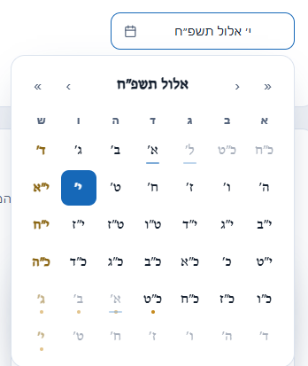

<div align="center">

# heb-date-picker

**בורר תאריכים (Date Picker) לפי הלוח העברי — ל-Angular.**

תאריכים מוצגים כפי שנהוג לכתוב אותם בעברית — **`כ״א אלול תשפ״ו`** — ולא כמספרים.
רכיב מוכן להטמעה, עם RTL, חגים, מצב טווח וחיבור מלא ל-Angular Forms.

[](https://www.npmjs.com/package/heb-date-picker)
[](https://www.npmjs.com/package/heb-date-picker)
[](LICENSE)
[](https://angular.dev)
[](https://github.com/avi-rav/hebrew-datepicker/actions/workflows/ci.yml)

**[▶ דמו חי](https://avi-rav.github.io/hebrew-datepicker/)**



</div>

---

## תוכן עניינים

[יכולות](#יכולות) · [דמו](#דמו-חי) · [התקנה](#התקנה) · [שימוש](#שימוש) ·
[הערך שמתקבל](#הערך-שמתקבל-output) · [API](#api) · [עיצוב ומיתוג](#עיצוב-ומיתוג-css-custom-properties) ·
[נגישות](#נגישות-וניווט-מקלדת) · [תלויות ותאימות](#תלויות-ותאימות) ·
[פיתוח (monorepo)](#פיתוח-monorepo) · [רישיון](#רישיון)

## יכולות

- 🗓️ **גימטריה** — יום, חודש ושנה בעברית (`כ״א אלול תשפ״ו`), עם או בלי ניקוד
- ↔️ **RTL מובנה** — גם אם שאר האפליקציה שלכם ב-LTR
- 📌 **יום יחיד או טווח** — `mode="single"` / `mode="range"`
- 🚫 **מגבלות** — `min`, `max`, ופרדיקט `disabledDates` לחסימת ימים לפי לוגיקה שלכם
- 🕯️ **חגים אוטומטיים** — שבתות, מועדים וראשי-חודשים; לוח ארץ-ישראל או תפוצות
- 📍 **כפתור "היום"** — חזרה מהירה לחודש הנוכחי מכל מקום בלוח
- 🪟 **Popup שלא נחתך** — הפאנל מרונדר דרך CDK Overlay ומוצמד ל-`<body>`
- ♿ **נגישות** — `role="grid"`, ניווט מקלדת מלא, `aria-*`
- 🎨 **מיתוג דרך CSS Variables** — כולל מצב כהה, בלי לדרוס selectors
- 🔌 **Angular Forms** — `ControlValueAccessor` מלא: `ngModel`, `formControl`, `[(value)]`
- 🧩 **ליבה אגנוסטית** — כל החישובים ב-`heb-date-core`, ללא תלות ב-Angular

## דמו חי

**[▶ avi-rav.github.io/hebrew-datepicker](https://avi-rav.github.io/hebrew-datepicker/)**
— כל האפשרויות בפעולה: בחירת יום, טווח, מגבלות, חגים, ניקוד, מיתוג ומצב כהה.
(המקור: [`docs/index.html`](docs/index.html))

להרצה מקומית מתוך ה-repo:

```bash
npm install
npm start          # http://localhost:4200
```

## התקנה

```bash
npm i heb-date-picker
```

זהו — פקודה אחת. `heb-date-core` ו-`@hebcal/core` נמשכות אוטומטית, ואין CSS נפרד לייבא.

> **דרישה:** נבדק ונתמך כיום ב-Angular ‎`19` · `20` · `21` · `22`
> (`@angular/core`, `@angular/common`, `@angular/forms`, `@angular/cdk`).
>
> חשוב: התקינו את `@angular/cdk` **באותה גרסת major** כמו ה-Angular שלכם — למשל
> Angular 19 ← ‏`npm i @angular/cdk@19`. ‏npm מתקין peer חסר בגרסה הגבוהה ביותר,
> ולכן בלי לציין גרסה הוא עלול למשוך CDK חדש מדי ולהיכשל ב-ERESOLVE.

## שימוש

הרכיב הוא **standalone** — מוסיפים אותו ל-`imports` של הקומפוננטה, בלי NgModule:

```ts
import { Component, signal } from '@angular/core';
import { FormsModule } from '@angular/forms';
import { HebDatePickerComponent, type PickerValue } from 'heb-date-picker';

@Component({
  selector: 'app-my-form',
  standalone: true,
  imports: [HebDatePickerComponent, FormsModule],
  template: `
    <heb-date-picker [(ngModel)]="date" placeholder="בחרו תאריך…" />
    <p>נבחר: {{ date() }}</p>
  `,
})
export class MyFormComponent {
  date = signal<PickerValue>(null); // Date | null
}
```

### מצב popup (ברירת מחדל) ומצב inline

```html
<!-- שדה עם אייקון; לחיצה פותחת פאנל צף שלא נחתך גם בתוך overflow: hidden -->
<heb-date-picker [(ngModel)]="date" />

<!-- לוח מוטמע ישירות בדף -->
<heb-date-picker [(ngModel)]="date" [inline]="true" />
```

### Reactive Forms

הרכיב מממש `ControlValueAccessor`, כך שהוא מתחבר ל-`FormGroup` קיים כמו `<input>` רגיל:

```ts
form = new FormGroup({
  birthDate: new FormControl<PickerValue>(null, Validators.required),
});
```

```html
<form [formGroup]="form">
  <heb-date-picker formControlName="birthDate" />
</form>
```

### מצב טווח

```html
<heb-date-picker [(ngModel)]="range" mode="range" />
```

הערך הוא `HebRange` = `{ start: Date | null; end: Date | null }`. קליק ראשון קובע
התחלה, קליק שני קובע סוף (הקצוות ממוינים אוטומטית), ובשדה מוצג `כ״א אלול תשפ״ו – כ״ה אלול תשפ״ו`.

### מגבלות: min / max / ימים חסומים

```ts
min = new Date(2026, 0, 1);
max = new Date(2026, 11, 31);
noWeekends = (d: Date) => d.getDay() === 5 || d.getDay() === 6; // חסימת שישי ושבת
```

```html
<heb-date-picker [(ngModel)]="date" [min]="min" [max]="max" [disabledDates]="noWeekends" />
```

### חגים, ניקוד ולוח תפוצות

```html
<heb-date-picker [(ngModel)]="date" [showNikud]="true" />   <!-- כ״א אֱלוּל תשפ״ו -->
<heb-date-picker [(ngModel)]="date" [israel]="false" />     <!-- יום-טוב שני של גלויות -->
```

חגים ומועדים מסומנים בנקודה מתחת ליום ובשם המועד ב-tooltip; שבתות וראשי-חודשים מסומנים בסגנון משלהם.

## הערך שמתקבל (Output)

**הפלט הוא `Date` רגיל של JavaScript** (גרגוריאני, מנורמל לחצות מקומית) — לא מחרוזת
ולא טיפוס עברי מיוחד. הגימטריה היא *תצוגה* בלבד; מאחוריה יושב תאריך רגיל שקל לשמור,
לשלוח לשרת ולהשוות.

| `mode` | סוג הערך |
|---|---|
| `'single'` | `Date \| null` |
| `'range'` | `HebRange` = `{ start: Date \| null; end: Date \| null }` |

> [!WARNING]
> **אל תשתמשו ב-`date.toISOString()`** לתאריך-בלבד. היא ממירה ל-UTC, בעוד הערך מנורמל
> לחצות **מקומית** — ולכן בישראל (UTC+2/+3) התאריך "גולש" יום אחורה:
> `כ״א אלול` (3.9.2026) הופך ל-`"2026-09-02T21:00:00.000Z"`. השתמשו ב-`toISODate()`
> המיוצאת מהחבילה, שקוראת את שדות התאריך המקומיים ישירות.

```ts
import { formatGematriya, toISODate, type PickerValue } from 'heb-date-picker';

onPick(value: PickerValue) {
  if (value instanceof Date) {
    const iso = toISODate(value);          // "2026-09-03"     → לשרת / DB
    const label = formatGematriya(value);  // "כ״א אלול תשפ״ו" → לתצוגה למשתמש
    this.save({ date: iso, label });
  }
}
```

## API

### Inputs

| Input | סוג | ברירת מחדל | תיאור |
|---|---|---|---|
| `mode` | `'single' \| 'range'` | `'single'` | בחירת יום יחיד או טווח |
| `value` | `Date \| HebRange \| null` | `null` | הערך; ניתן ל-`[(value)]`, `ngModel`, `formControl` |
| `min` | `Date \| null` | `null` | היום המוקדם ביותר לבחירה (כולל) |
| `max` | `Date \| null` | `null` | היום המאוחר ביותר לבחירה (כולל) |
| `disabledDates` | `(d: Date) => boolean` | — | החזרת `true` חוסמת את היום |
| `showNikud` | `boolean` | `false` | גימטריה עם ניקוד |
| `israel` | `boolean` | `true` | לוח חגים א״י (`true`) או תפוצות (`false`) |
| `firstDayOfWeek` | `number` | `0` | העמודה הראשונה: 0=ראשון … 6=שבת |
| `inline` | `boolean` | `false` | לוח מוטמע במקום popup עם שדה |
| `placeholder` | `string` | `'בחר תאריך'` | טקסט לשדה ה-popup |

### Outputs

| Output | סוג | תיאור |
|---|---|---|
| `valueChange` | `PickerValue` | בכל שינוי ערך (מאפשר `[(value)]`) |
| `monthChange` | `HebMonthRef` — `{ year, month }` | כשהחודש המוצג משתנה. חודשים במספור `@hebcal/core`: ניסן=1 … אלול=6 … תשרי=7 … אדר ב׳=13 |

### פונקציות עזר מיוצאות

```ts
import { formatGematriya, toISODate, months } from 'heb-date-picker';

formatGematriya(new Date(2026, 8, 3));                  // "כ״א אלול תשפ״ו"
formatGematriya(new Date(2026, 8, 3), { nikud: true }); // "כ״א אֱלוּל תשפ״ו"
toISODate(new Date(2026, 8, 3));                        // "2026-09-03" (מקומי, לא UTC)
```

## עיצוב ומיתוג (CSS Custom Properties)

כל צבע ומידה נשלטים דרך משתני CSS בקידומת `--hdp-`. מגדירים אותם על כל אב-קדמון —
בלי לדרוס selectors ובלי לגעת בקוד הרכיב:

```css
.my-theme {
  --hdp-accent: #0ca678;      /* צבע הבחירה */
  --hdp-accent-fg: #ffffff;
  --hdp-in-range-bg: #c3fae8; /* רקע ימים בטווח */
  --hdp-today-ring: #0ca678;
  --hdp-radius: 20px;
  --hdp-cell-size: 2.6rem;
  --hdp-shabbat-fg: #b4881d;
  --hdp-holiday-dot: #e8590c;
}
```

**מצב כהה:** הרכיב מגיב אוטומטית ל-`[data-theme="dark"]` על כל אב-קדמון.

**קלאסים סמנטיים** לעיצוב מדויק: `hdp-cell--selected`, `--in-range`, `--range-start/-end`,
`--today`, `--shabbat`, `--holiday`, `--rosh-chodesh`, `--disabled`, `--other-month`.

> [!NOTE]
> **הפופאפ נפתח מאחורי מודאל?** ה-Overlay יושב כברירת מחדל על `z-index: 1000`. אם המודאל
> שלכם גבוה יותר, הגדירו `:root { --hdp-overlay-z-index: 4000; }` — **חייב** להיות על
> `:root` ולא על הרכיב, כי הפאנל מוצמד ל-`<body>` ולא יורש משתנים מתוך הרכיב.

## נגישות וניווט מקלדת

| מקש | פעולה |
|---|---|
| `←` `→` | יום קודם / הבא (מכבד RTL) |
| `↑` `↓` | שבוע אחורה / קדימה |
| `Home` / `End` | תחילת / סוף השבוע |
| `PageUp` / `PageDown` | חודש אחורה / קדימה |
| `Enter` / `Space` | בחירת היום שבמיקוד |
| `Esc` | סגירת ה-popup |

## תלויות ותאימות

| תלות | מאיפה | תפקיד |
|---|---|---|
| `heb-date-core` | נמשכת אוטומטית | ליבת הלוח העברי (חבילת האחות) |
| `@hebcal/core` | נמשכת אוטומטית (טרנזיטיבית) | מנוע חישוב התאריכים והחגים |
| `@angular/cdk` | peer | ה-Overlay של הפופאפ |
| `@angular/core` · `common` · `forms` | peer — קיימות אצלכם | Angular עצמו |

נבנה מול **Angular 22** בקומפילציה חלקית (`partial`) — ה-linker של האפליקציה שלכם
מקמפל מחדש את התבניות בגרסת ה-Angular שלכם. **נבדק ונתמך כיום ב-Angular 19–22**:
כל גרסה נבדקת אוטומטית ב-CI (build + הרצה אמיתית בדפדפן) בכל שינוי, וניתן להריץ
את אותה בדיקה מקומית עם `npm run smoke -- <major>`. עובד גם באפליקציות מבוססות
Zone וגם ב-Zoneless (הרכיב בנוי על signals ו-OnPush בלבד). אין תלות ב-jQuery / Moment.
משקל משוער: הרכיב + הליבה + `@hebcal/core` ≈ ‎~50KB gzip (רובו `@hebcal/core`).

## פיתוח (monorepo)

| פרויקט | תיאור |
|---|---|
| [`projects/heb-date-core`](projects/heb-date-core) | ליבת לוח עברי **אגנוסטית לפריימוורק** (TS טהור מעל `@hebcal/core`). ללא Angular. |
| [`projects/heb-date-picker`](projects/heb-date-picker) | ספריית ה-Angular (`<heb-date-picker>`) — חבילת ה-npm המפורסמת. |
| [`projects/demo`](projects/demo) | אפליקציית ההדגמה. גרסה סטטית שלה: [`docs/index.html`](docs/index.html). |

הפרדת הליבה מה-UI (Dependency Inversion) היא מה שיאפשר בעתיד עטיפת React מעל אותה
ליבה בדיוק, והיא גם מבודדת את `@hebcal/core` מאחורי קובץ אחד (`hdate-utils.ts`).

אפשר לצרוך את הליבה גם ישירות, בלי Angular:

```ts
import { buildMonthView, SingleSelectionModel, months } from 'heb-date-core';

const view = buildMonthView(5786, months.ELUL, { selection: new SingleSelectionModel() });
view.title;             // "אלול תשפ״ו"
view.weeks[0][0].label; // תגית הגימטריה של התא הראשון
```

```bash
npm install
npm start                                # דמו על http://localhost:4200

ng build heb-date-core && ng build heb-date-picker
ng test heb-date-core --watch=false      # Vitest
ng test heb-date-picker --watch=false
```

### פרסום

שתי החבילות מתפרסמות יחד — צרכן מריץ `npm i heb-date-picker` בלבד, ו-npm מושך את
`heb-date-core` ואת `@hebcal/core` אוטומטית (כמו ש-Angular Material מושך את `@angular/cdk`):

```bash
ng build heb-date-core && ng build heb-date-picker
cd dist/heb-date-core  && npm publish
cd ../heb-date-picker  && npm publish
```

## רישיון

מופץ תחת **[GPL-2.0](LICENSE)**, בהתאם לרישיון של `@hebcal/core` שעליו נשענים חישובי
הלוח. שימו לב לכך בשילוב בפרויקטים קנייניים/סגורים.
